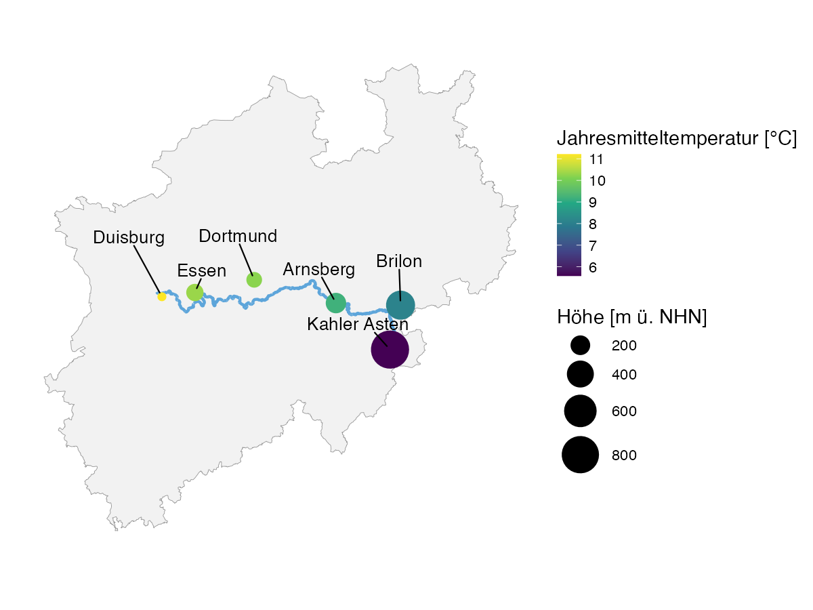
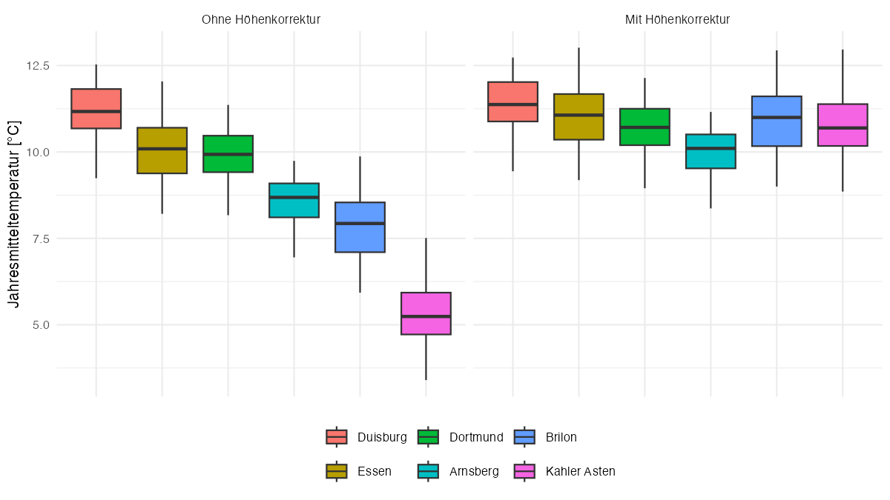

# Climate Analysis Ruhr Area & Sauerland: Temporal and Spatial Temperature Differences

Case study from the module *Fallstudien I* (Faculty of Statistics, TU Dortmund).
Group project.

## Research Question

Has the climate in the Ruhr area noticeably warmed over the past decades?
How large are the temperature differences between six stations in the
Ruhr area and Sauerland — can they be explained by elevation alone?

**Data:** Historical daily mean temperatures (aggregated to annual/seasonal values)
from six weather stations (Duisburg, Essen, Dortmund, Arnsberg, Brilon, Kahler
Asten), provided by the [European Climate Assessment & Dataset](https://www.ecad.eu/download/millennium/millennium.php).

## Approach

| Step | Script | Method |
|---|---|---|
| Data preparation | `01_data_cleaning.R` | Import, unit conversion, missing values |
| Descriptive analysis | `02_eda.R` | Distribution shape per station (boxplot, KDE, QQ-plot) |
| Hypothesis testing | `03_hypothesis_tests.R` | Welch's t-test, Kruskal-Wallis, pairwise Wilcoxon (Holm) |
| Regression analysis | `04_adiabatic_effect.R` | Linear model, model comparison |
| Spatial visualization | `05_spatial_map.R` | Station map of NRW (temperature & elevation) |

## Results



At a glance: temperature noticeably decreases from the northwest (Duisburg,
low elevation, warmer) toward the southeast (Kahler Asten, the highest
elevation in the Sauerland, considerably colder) — an initial visual
indication of the elevation effect quantified further below.

**1. Temporal warming (Essen, 1950–1980 vs. 1990–2020)**

The annual mean temperature rose from 9.52 °C to 10.58 °C. Although the
variances of the two periods were classified as statistically homogeneous, a
Welch's t-test was used (minimal power loss compared to the standard t-test):
**p < 0.001**, effect size Cohen's d ≈ 1.6 (very large effect).

**2. Spatial differences between the 6 stations (1950–1995)**

A Kruskal-Wallis test (robust alternative to ANOVA) shows statistically
significant differences between the stations (**p < 0.001**, ε² ≈ 0.84 —
strong effect). The pairwise Wilcoxon test (Holm-corrected) shows that all
station pairs differ significantly — with the exception of Dortmund–Essen.

**3. Does elevation explain the spatial differences?**



A linear regression of annual mean temperature on elevation confirms the
expected adiabatic effect almost exactly: **−0.65 °C per 100 m of elevation**
(reference value: −0.65 °C/100m). However, a model comparison shows that a
model additionally accounting for the individual station explains the data
significantly better (F-test, p < 0.001) — elevation therefore only partially
explains the spatial differences; other local factors play a role as well.

## Statistical Methodology in Detail

- **Assumption checks before test selection:** F-test for homogeneity of
  variance before choosing between Student's and Welch's t-test
- **Robust alternatives:** Kruskal-Wallis instead of ANOVA, since with six
  groups the normality assumption shouldn't be overstretched
- **Correction for multiple testing:** Holm correction for 15 pairwise
  comparisons, to control the inflation of the type I error
- **Effect sizes instead of p-values alone:** Cohen's d and epsilon-squared,
  to assess practical relevance alongside statistical significance

## Reproducibility

```bash
git clone https://github.com/kubaamarczak/case-studies-1
cd project-2
Rscript R/01_data_cleaning.R
Rscript R/02_eda.R
Rscript R/03_hypothesis_tests.R
Rscript R/04_adiabatic_effect.R
Rscript R/05_spatial_map.R
```

Required packages: `dplyr`, `readr`, `tidyr`, `ggplot2`, `patchwork`, `sf`, `ggrepel`.

The NRW geometry for the map and the river course require internet access to run.

## Tools

R (tidyverse, ggplot2)
