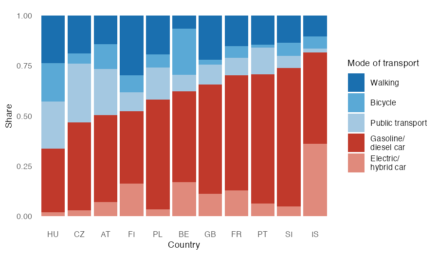
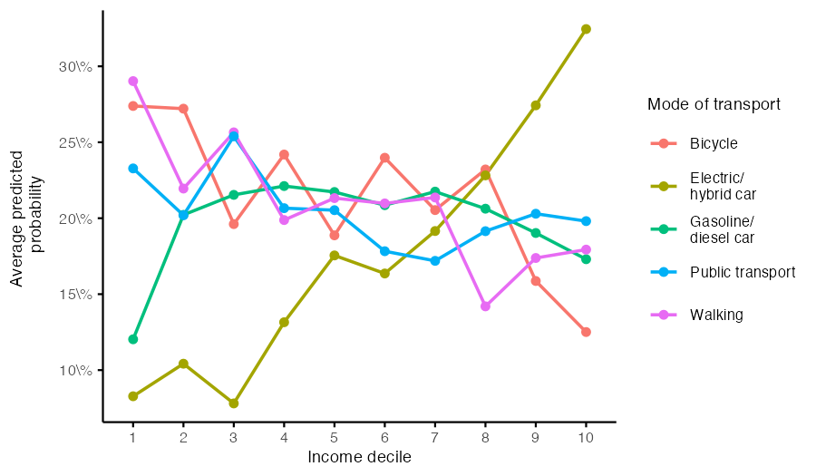

# Classification of Everyday Mobility Choices
 
Case study from the module *Fallstudien I* (Faculty of Statistics, TU Dortmund).
Group project.
 
## Research Question
 
Which demographic, socioeconomic, and attitudinal factors explain the choice of
main mode of transport? A multinomial logistic regression (MLR) is fitted and
compared to an XGBoost model in terms of predictive performance. Additionally,
the effect of upsampling on the detection of minority classes is examined.
 
**Data:** Sixth wave of the CRONOS-3 panel study (CROss-National Online Survey),
conducted by the [European Social Survey (ESS)](https://ess.sikt.no/en/study/dad96456-2ab4-42e3-8272-166bf5749bf9/).
n = 9585 raw observations, reduced to n = 7330 after removing unclassifiable
target responses and complete-case filtering. Five mode-of-transport classes are
distinguished: walking, bicycle, public transport, gasoline/diesel car, and
electric/hybrid car.
 
## Approach
 
| Step | Script | Method |
|---|---|---|
| Data preparation | `01_data_cleaning.R` | Import, missing-value recoding, complete-case filtering |
| Descriptive analysis | `02_eda.R` | Variable screening (Cramér's V, Kruskal-Wallis/ε²), stacked bar and box plots |
| Multinomial logistic regression | `03_mult_log_reg.R` | Assumption checks, stepwise AIC selection, upsampling, odds ratios |
| XGBoost | `04_xgboost.R` | Cross-validated gradient boosting, upsampling, feature importance |
 
## Results
 

 
At a glance: the target variable is strongly imbalanced — gasoline/diesel car
accounts for 49.5 % of respondents (walking 17.4 %, electric/hybrid car 12.7 %,
public transport 11.8 %, bicycle 8.6 %) — and mode-of-transport shares differ
sharply by country, from car-dominated Slovenia and Portugal to Hungary's high
shares of walking, cycling, and public transport.
 
**1. Predictor importance (Type II likelihood-ratio tests)**
 
Country is by far the strongest predictor (LR-χ² = 2988.72, df = 40, p < 0.001),
followed by satisfaction with public transport infrastructure (757.44), income
decile (569.86), and main activity (300.28). All 13 predictors in the final
model contribute significantly (p < 0.05).
 
**2. Country and income effects**
 
Odds ratios relative to gasoline/diesel car (reference country: Austria) vary
substantially — e.g. Iceland shows an OR of 5.43 for electric/hybrid cars, while
Hungary shows elevated odds for walking (2.43) and bicycle (2.80). Income shows
a clean gradient: the predicted probability of choosing an electric/hybrid car
rises from below 10 % in the lowest income deciles to over 30 % in the highest,
with an OR of 2.35 in the top decile relative to decile 1.
 

 
**3. Climate attitude**
 
A one-unit increase in climate concern raises the odds of bicycle (OR = 1.55),
public transport (OR = 1.43), and walking (OR = 1.34) relative to gasoline/diesel
car, but is not significant for electric/hybrid cars (OR = 1.07) — suggesting
EV adoption in this sample is driven more by income than by climate attitude.
 
**4. Nonlinear age effect**
 
The empirical logit plot indicated a u-shaped pattern for age in the public
transport contrast. A quadratic age term significantly improves model fit
(AIC 17679.27 → 17653.06, LR-χ²(4) = 34.21, p < 0.001) and is retained in all
subsequent models. Stepwise AIC selection additionally removes internet use
and education level, arriving at a final model with AIC = 17636.98.
 
**5. Prediction and class imbalance**
 
| Metric | MLR | MLR + upsampling | XGBoost | XGBoost + upsampling |
|---|---|---|---|---|
| Accuracy | 53.66 % | 38.47 % | 54.30 % | 41.70 % |
| Cohen's Kappa | 0.211 | 0.213 | 0.204 | 0.209 |
| Balanced Accuracy | 58.19 % | 63.01 % | 58.74 % | 63.93 % |
| Macro Recall | 32.59 % | 41.40 % | 31.88 % | 38.16 % |
 
Without upsampling, both models classify almost exclusively the majority class
(gasoline/diesel car sensitivity 87.97 % for MLR, versus 8–25 % for all other
classes). Upsampling the training data trades overall accuracy for a markedly
more balanced classification (e.g. MLR bicycle sensitivity rises from 8.23 % to
39.24 %). XGBoost performs on par with the MLR overall, with no clear predictive
advantage — given comparable performance and the interpretability of odds
ratios, the multinomial logistic regression is preferred for the substantive
analysis.
 
## Statistical Methodology in Detail
 
- **Assumption checks before model finalization:** separation test
  (`detectseparation`), generalized variance inflation factors for
  multicollinearity (all GVIF^(1/2df) between 1.0 and 1.6), and empirical logit
  plots to assess linearity in the log-odds
- **Nonlinear terms where warranted:** a quadratic age term is added and
  confirmed via likelihood-ratio test rather than assumed a priori
- **Automatic model selection:** stepwise AIC selection (both directions) to
  reach a parsimonious final model
- **Class imbalance handling:** upsampling of the training data only (test set
  untouched), evaluated via Balanced Accuracy and Macro Recall rather than
  accuracy alone, since accuracy is misleading under strong class imbalance
- **Method comparison:** XGBoost as a non-linear, non-parametric benchmark,
  evaluated with the identical train/test split and metrics as the MLR to
  ensure a fair comparison
## Reproducibility
 
```bash
git clone https://github.com/kubaamarczak/case-studies-1
cd project-5
Rscript 01_data_cleaning.R
Rscript 02_eda.R
Rscript 03_mult_log_reg.R
Rscript 04_xgboost.R
```
 
Required packages: `readr`, `dplyr`, `tidyr`, `ggplot2`, `patchwork`, `nnet`,
`car`, `MASS`, `caret`, `forcats`, `tibble`, `detectseparation`, `xgboost`,
`Matrix`.
 
## Tools
 
R (tidyverse, ggplot2, nnet, xgboost)